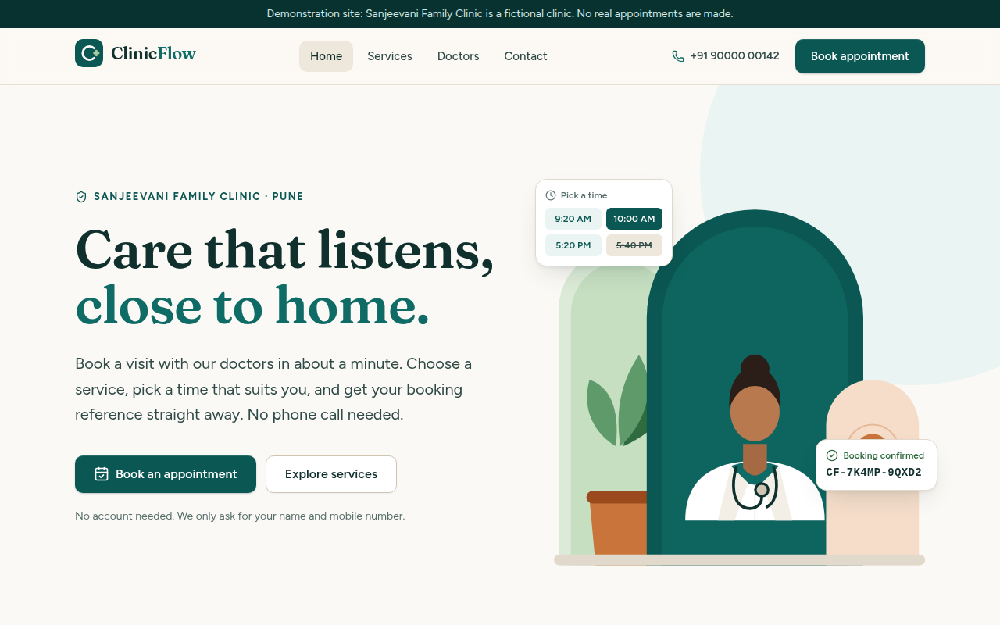
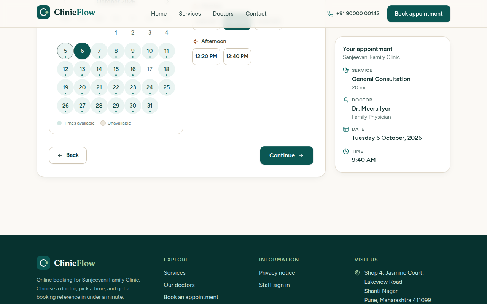
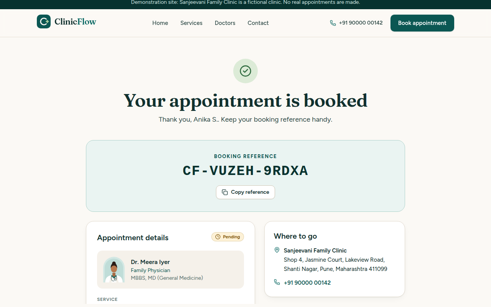
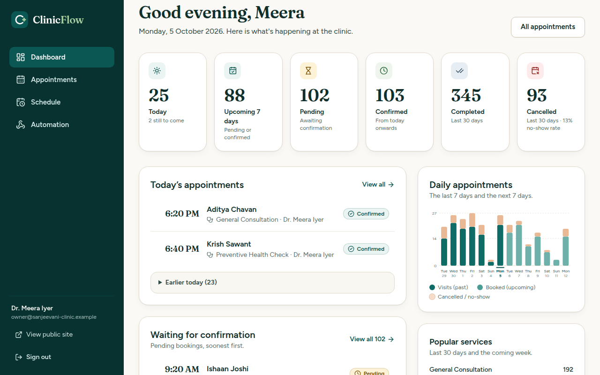
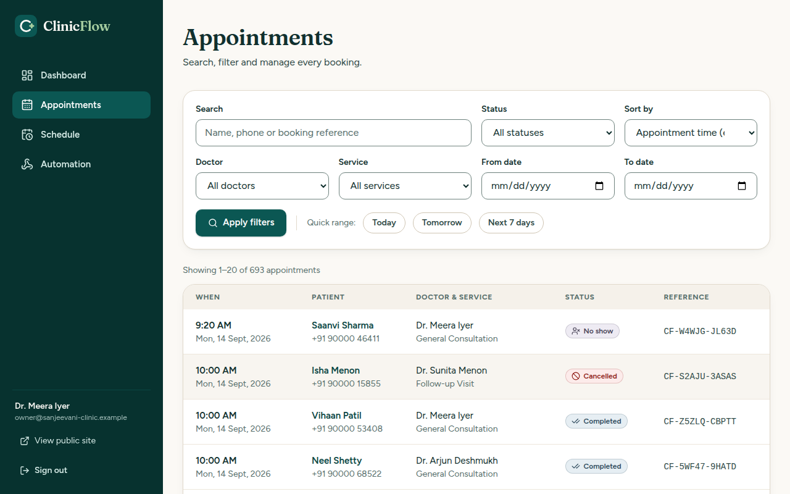
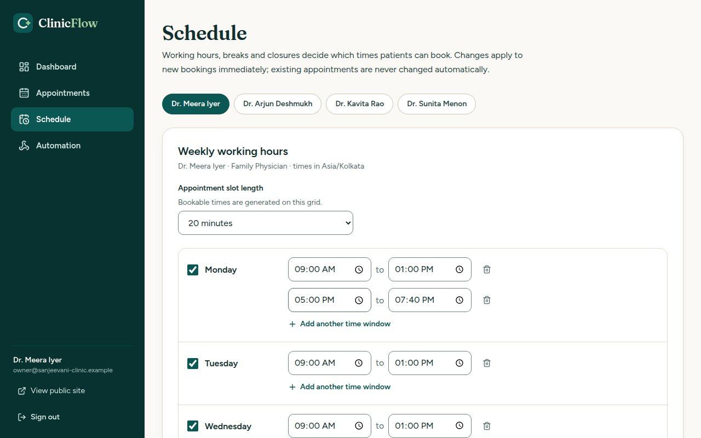

# ClinicFlow

A professional clinic website and appointment management application. Patients discover the clinic,
pick a service, a doctor and a genuinely free time slot, and receive a booking reference in about a
minute. Clinic staff get a calm dashboard for today's appointments, status changes, doctor schedules
and holidays.

The included demo is **Sanjeevani Family Clinic**, a fictional clinic in Pune with fictional doctors,
patients, phone numbers and testimonials. ClinicFlow is the software; the clinic is replaceable data.

|                                                                    |                                                                           |
| ------------------------------------------------------------------ | ------------------------------------------------------------------------- |
|                     |  |
|  |                   |
|            |                |

Mobile: [home](docs/screenshots/home-mobile.png) · [booking](docs/screenshots/booking-mobile.png).
More: [services](docs/screenshots/services-desktop.png) · [doctors](docs/screenshots/doctors-desktop.png) ·
[admin login](docs/screenshots/admin-login.png) · [appointment detail](docs/screenshots/admin-appointment-detail.png) ·
[automation events](docs/screenshots/admin-events.png).

## Features

**Patients**

- Home, services and doctors pages with clinic hours, location and (fictional) testimonials
- Multistep booking: service → doctor → date and time → details → review → confirmation
- Only real, open slots are shown (doctor hours, breaks, holidays, existing bookings, minimum notice)
- Field-level validation, clear messages, and recovery if a slot is taken while reviewing
- Confirmation page with a non-guessable booking reference, directions, next steps, calendar (.ics) download

**Clinic staff**

- Secure sign-in (Supabase Auth); no public registration; protected routes
- Dashboard: today's schedule, upcoming, pending, confirmed, completed and cancelled counts, a daily
  chart, popular services, doctor workload and recent activity
- Appointments: search (name, phone, reference), filter (date, doctor, service, status), sort,
  detail view with history, confirm / complete / no-show / cancel (with confirmation), reschedule, notes
- Schedule: weekly hours (including split shifts), slot length, breaks, holidays and unavailable dates

**Platform**

- Double-booking is impossible: an exclusion constraint in PostgreSQL is the final guard, backed by a
  per-doctor lock and a recheck at submission (proven by concurrency tests)
- Row Level Security on every table; the browser never receives any Supabase key
- Automation outbox for a future n8n integration: works fully without n8n
- Accessible (WCAG 2.1 AA checks in CI), responsive, reduced-motion aware, no remote fonts or images

## Architecture in brief

```
Browser ── HTML/RSC + Server Actions ──▶ Next.js (App Router, Node)
                                              │  server-side only
                      anon key (public data, booking RPCs)   user JWT (admin, RLS)   service key (rare)
                                              ▼
                                  Supabase: PostgreSQL + Auth (+ PostgREST)
                                              │ outbox table
                                              ▼
                       /api/cron/dispatch-events ──▶ signed webhook ──▶ n8n (optional, later)
```

Full detail: [docs/ARCHITECTURE.md](docs/ARCHITECTURE.md) · schema: [docs/DATABASE.md](docs/DATABASE.md) ·
security: [docs/SECURITY.md](docs/SECURITY.md).

## Technology

Next.js 16 (App Router, Turbopack) · React 19 · TypeScript (strict) · Tailwind CSS 4 · Zod 4 ·
Supabase (PostgreSQL 17, Auth) via `@supabase/supabase-js` and `@supabase/ssr` · Vitest · Playwright +
axe-core · locally bundled fonts (Fraunces, Figtree, SIL OFL) and SVG art. Everything runs on free tiers.

## Local setup

Prerequisites: **Node.js 22+**, **Docker** (for the local Supabase stack), `git`.

```bash
npm ci

# 1. Start the local Supabase stack (PostgreSQL, Auth, API)
npm run db:start

# 2. Write .env.local from the running stack (never hand-copy keys)
npm run env:local

# 3. Apply every migration and load the fictional demo data (safe to repeat at any time)
npm run db:reset

# 4. Create your first administrator (prompts for a password; it never goes on the command line)
npm run admin:create -- --email you@example.com --name "Your Name"

# 5. Run the app
npm run dev          # http://localhost:3000   (admin: http://localhost:3000/admin)
```

Stop the stack with `npm run db:stop`. Supabase Studio (database browser) is at http://127.0.0.1:54323
when the full stack is running.

> **Restricted networks.** If the Supabase CLI cannot pull images from `ghcr.io`, set
> `SUPABASE_INTERNAL_IMAGE_REGISTRY=docker.io` for the CLI commands (this is how the project was built
> and verified in a sandbox). On a normal machine you do not need it.

## Environment variables

Copy `.env.example` to `.env.local` (or run `npm run env:local`). All are read on the server at runtime;
there are no `NEXT_PUBLIC_` variables.

| Variable                      | Required | Purpose                                                                          |
| ----------------------------- | :------: | -------------------------------------------------------------------------------- |
| `SUPABASE_URL`                |   yes    | Project URL (local: `http://127.0.0.1:54321`)                                    |
| `SUPABASE_ANON_KEY`           |   yes    | Anon / publishable key                                                           |
| `SUPABASE_SERVICE_ROLE_KEY`   |    no    | Only for `admin:create` and the automation dispatcher. Server-only, bypasses RLS |
| `SITE_URL`                    |    no    | Public site URL (canonical links, sitemap, robots)                               |
| `SHOW_DEMO_NOTICE`            |    no    | `false` removes the "demonstration site" strip for a real clinic                 |
| `BOOKING_RATE_LIMIT_PER_HOUR` |    no    | Booking submissions per client address per hour (default 8)                      |
| `LOGIN_ATTEMPTS_PER_15_MIN`   |    no    | Sign-in attempts per e-mail per 15 minutes (default 6)                           |
| `CRON_SECRET`                 |    no    | Bearer secret for the dispatcher endpoint (16+ chars)                            |
| `N8N_WEBHOOK_URL`             |    no    | Webhook the dispatcher posts events to                                           |
| `N8N_WEBHOOK_SECRET`          |    no    | HMAC signing secret (defaults to `CRON_SECRET`)                                  |
| `N8N_WEBHOOK_AUTH_TOKEN`      |    no    | Optional static `X-ClinicFlow-Token` header                                      |
| `EVENT_REMINDER_LEAD_HOURS`   |    no    | Hours before an appointment that `reminder_due` is queued (default 24)           |
| `EVENT_RETENTION_DAYS`        |    no    | Days to keep delivered events (default 30)                                       |

## Database: migrations and seed data

All database changes live in versioned files under `supabase/migrations/`. The fictional demo data is
`supabase/seed.sql` (dates are relative to "today", so the demo always looks current).

```bash
npm run db:reset      # local: drop, re-apply every migration, load seed data
npm run db:types      # regenerate src/lib/supabase/database.types.ts after schema changes
```

Hosted projects: see [docs/DEPLOYMENT.md](docs/DEPLOYMENT.md) (`supabase link`, `supabase db push`).
Schema reference and design decisions: [docs/DATABASE.md](docs/DATABASE.md).

## Tests and quality gates

```bash
npm run lint           # ESLint (Next.js + TypeScript rules)
npm run typecheck      # tsc --noEmit with strict flags
npm test               # unit tests (no services needed)
npm run test:db        # database integration tests (needs `npm run db:start`)
npm run test:e2e       # Playwright: builds, starts the production server, drives real browsers
npm run verify         # lint + typecheck + unit tests + production build
```

What is covered, and how to run a single test: [docs/TESTING.md](docs/TESTING.md). Manual accessibility
checklist: [docs/ACCESSIBILITY.md](docs/ACCESSIBILITY.md).

## Deployment (Render + hosted Supabase, free tiers)

1. Create a Supabase project; `supabase link --project-ref <ref>`; `supabase db push`
2. Disable public sign-ups; create the first administrator with `npm run admin:create`
3. On Render choose **New → Blueprint** (uses `render.yaml`) and fill in the environment variables
4. Verify with the post-deployment checklist

Step-by-step with every command, the Render variables and the verification checklist:
[docs/DEPLOYMENT.md](docs/DEPLOYMENT.md). The health check is `GET /api/health` (add `?deep=1` to also test the database).

## Connecting n8n later

The app never needs n8n. Every booking change is written to an outbox table in the same database
transaction, so bookings cannot fail because an automation service is down. When the owner is ready,
setting three environment variables enables signed webhook delivery with retries.
See [docs/N8N_INTEGRATION.md](docs/N8N_INTEGRATION.md) for the payloads, authentication, scheduling options and a
local receiver to try it without n8n (`npm run webhook:receiver`).

## Project structure

```
src/app/(public)/      public site and booking flow          src/app/admin/      staff area
src/app/api/           health check and dispatcher            src/proxy.ts        CSP nonce + admin gate
src/components/        ui kit, booking wizard, admin UI       src/lib/            data access, validation, events
supabase/migrations/   schema, functions, RLS (versioned)     supabase/seed.sql   fictional demo data
tests/unit, tests/db   Vitest suites                          e2e/                Playwright suites
docs/                  architecture, database, deployment, n8n, security, testing, decisions, handoff
```

## Demo limitations

- All clinic content, doctors, patients and testimonials are fictional. Placeholder phone numbers
  (`+91 90000 xxxxx`) and `.example` e-mail addresses are used throughout.
- ClinicFlow does not send SMS, WhatsApp or e-mail itself; that is what the n8n integration is for.
- Patients cannot cancel or reschedule on their own; they call the clinic and staff do it.
- Rate limiting is in memory per server instance (correct for one Render instance); the database
  enforces the per-phone booking cap regardless.
- The sample privacy notice is not legal advice and must be reviewed before a real launch.
- More honest limitations and next steps: [docs/BUILD_REPORT.md](docs/BUILD_REPORT.md), [docs/NEXT_STEPS.md](docs/NEXT_STEPS.md).

## Documentation index

[ARCHITECTURE](docs/ARCHITECTURE.md) · [DATABASE](docs/DATABASE.md) · [DEPLOYMENT](docs/DEPLOYMENT.md) ·
[N8N_INTEGRATION](docs/N8N_INTEGRATION.md) · [SECURITY](docs/SECURITY.md) · [TESTING](docs/TESTING.md) ·
[ACCESSIBILITY](docs/ACCESSIBILITY.md) · [DESIGN](docs/DESIGN.md) · [DECISIONS](docs/DECISIONS.md) ·
[BUILD_REPORT](docs/BUILD_REPORT.md) · [NEXT_STEPS](docs/NEXT_STEPS.md) · [PROJECT_BRIEF](docs/PROJECT_BRIEF.md)

Fonts are licensed under the SIL Open Font License (see `src/assets/fonts/`). Icons are from
[lucide](https://lucide.dev) (ISC).
